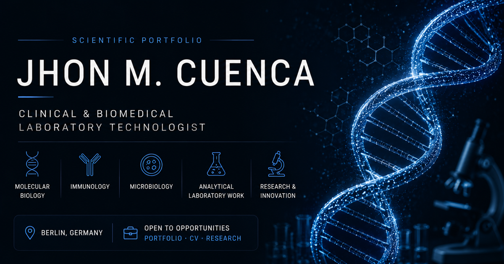

# Jhon M. Cuenca — Professionelles Portfolio

**Klinisches & biomedizinisches Labor · Molekularbiologie · Immunologie · Angewandte wissenschaftliche Arbeit**

**[English](README.md) · Deutsch · [Español](README.es.md)**

## Überblick

Dieses Repository enthält mein professionelles Portfolio als Laborfachkraft mit Schwerpunkt auf klinischen und biomedizinischen Laborbereichen. Es verbindet beruflichen Hintergrund, ausgewählte wissenschaftliche und technische Arbeiten sowie einen Workbench-Bereich für Projekte, Research Notes, angewandtes Lernen, Meilensteine und Arbeitsweise.

### Portfolio

Berufserfahrung, Ausbildung, Kompetenzen, ausgewählte Arbeiten, öffentliche Dokumente, berufliche Referenzen und Kontakt.

**[Professionelles Portfolio öffnen →](https://cuenca-john1999.github.io/de/)**

### Workbench

Ein dokumentierter Arbeitsbereich für Projekte, Research Notes, Technical & Learning, Meilensteine und Methodik. Einträge unterscheiden klar zwischen veröffentlichten Erkenntnissen, Interpretation, Hypothesen, vorgeschlagenen Methoden, Ergebnissen, Grenzen und nächsten Schritten.

**[Workbench öffnen →](https://cuenca-john1999.github.io/de/workbench/)**

## Ausgewählte Arbeiten

### [DeutschOS](https://cuenca-john1999.github.io/de/workbench/#entry-deutschos)

Ein lokales System zum Deutschlernen mit strukturierter Übung, Laborkontexten, dokumentierten Lerninhalten und KI-gestützter technischer Umsetzung. Der lokale Prototyp befindet sich in aktiver Entwicklung.

### [AETEL 2025 — Chitosan und Mikroplastik](https://cuenca-john1999.github.io/de/workbench/#entry-chitosan)

Eine literaturinformierte konzeptionelle Ausarbeitung zu möglichen medizinischen Anwendungen von Chitosan und dessen potenzieller Untersuchung zur Erfassung von Mikroplastik. Es wurde keine eigene experimentelle Validierung durchgeführt; das Konzept erfordert eine entsprechende In-vitro-Validierung.

### [Bakteriophagentherapie](https://cuenca-john1999.github.io/de/workbench/#entry-phage)

Eine gemeinsam verfasste akademische Literaturübersicht zu Bakteriophagentherapie, klinischen Anwendungen, Grenzen und regulatorischen Hürden. Das Projekt ist eine Literaturarbeit und keine eigene experimentelle oder klinische Studie.

## Wissenschaftliche Integrität

Wissenschaftliche Inhalte werden mit ihrem tatsächlichen Evidenzniveau dargestellt. Literatur, Interpretation, Hypothesen, vorgeschlagene Methoden, experimentelle Ergebnisse und Grenzen werden nicht miteinander gleichgesetzt.

## Entwicklung & Autorenschaft

Jhon definiert und genehmigt Ziele, Anforderungen, Inhalte, Produktentscheidungen, Tests und das Endergebnis. KI-Werkzeuge wie ChatGPT, Codex und Copilot können die technische Umsetzung, Organisation, Rechercheunterstützung und redaktionelle Prüfung unterstützen.

## Technologie

`HTML` · `CSS` · `Vanilla JavaScript` · `GitHub Pages` · `EN / DE / ES`

Technische Architektur, lokaler Preview-Workflow und Wartungshinweise sind in **[DEVELOPMENT.md](DEVELOPMENT.md)** dokumentiert.

## Lizenzhinweis

Dieses Repository enthält keine ausdrückliche Software- oder Inhaltslizenz. Aus dem Fehlen einer Lizenz darf keine Erlaubnis zur Weiterverwendung abgeleitet werden.
